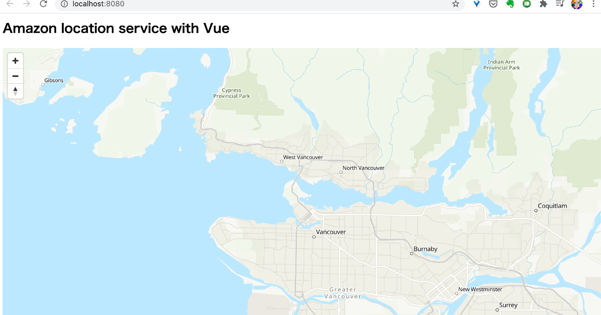

# amplify-location-services-maps

here is a sample of Amazon Location Service with Vue.
thanks for https://www.youtube.com/watch?v=-QcEMHqndzw.



```
$ vue create amplify-location-services-maps
$ cd amplify-location-services-maps
$ npm install aws-sdk aws-amplify
$ amplify init
$ amplify add auth
$ amplify push 

setup following on Management Console
- Enable to access to unauthorized identities
- apply inline policy to Amazon Location Service
```

---

## Project setup
```
npm install
```

### Compiles and hot-reloads for development
```
npm run serve
```

### Compiles and minifies for production
```
npm run build
```

